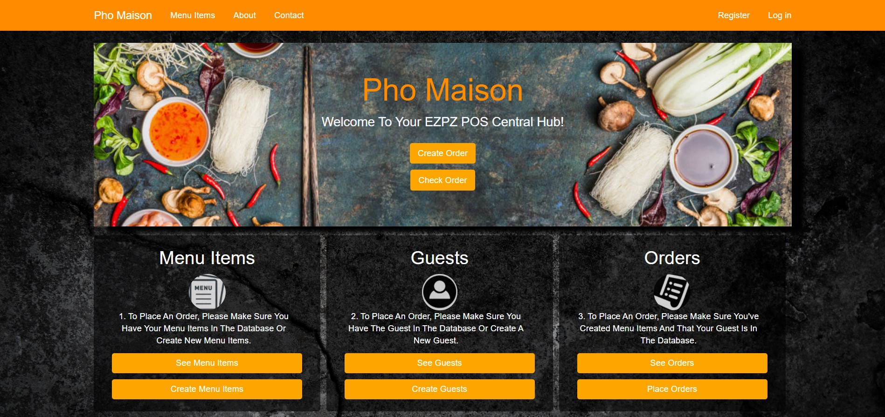

EZPZ Point Of Sales ASP.Net MVC Application
============================================

Visual Studio Community 2019 is a free software program provided to you through the good folks at Microsoft. You can download it by clicking the purple logo above.

> [!IMPORTANT]
> How To Download my ASP.Net MVC Application
>-------------------------
> Please feel free to clone and test my EZPZPOS application.
> 1. Since I am using C# as my programming language, please make sure you have already downloaded Visual Studio Community 2019. Click on the purple icon above if you'd like a download. VS Community 2019 runs on windows and can be bootcamped onto Macs.
> 2. There's a few different ways you can go about downloading my application, but I recommend if you're new to coding, just click on the green "Code" button to the right of the repository page to download the file. It'll be a zip file so after downloading, open your file explorer. Find the file wherever it is you chose to download it, and hit "Extract All" and then also select where you'd like to extract it. 
> 3. Once Extracted, find the file titled "EZPZPOS". 
> 4. Then double click on the solution file called "EZPZPOS.sln".
> 5. My assemblies for this application automatically open in VS Community 2019, assuming you have that downloaded already.
>-----------------------------------------------------------------------------------------------------
>-----------------------------------------------------------------------------------------------------

> [!IMPORTANT]
> How To Run EZPZPOS ASP.Net MVC Application
>---------------------------------------------
> 1. Before hitting the green launch button at the top of the screen, please update the database and make sure Nuget packages are correct. First open your package manager console. The simplest way is by searching for it using the searchbar at the top of your screen. Once you have your package manager open, simply run an "update-database" command and the database should be created and seeded with some base data. To ensure nuget packages are correct, simply right click my solution file name 'EZPZPOS' in the Solution Explorer and select "Restore NuGet Packages". If this option is greyed out, your packages are already correct and you dont need to worry about it. If for whatever reason your solution explorer isn't already pinned to the right of your screen, then just go to the top icon under View and select Solution Explorer or just use the shortcut Ctrl Alt L.
> 2. Then go to the green Start button at the top of your screen and select start, to launch the application. 
> 3. Assuming you have Google Chrome Web Browser installed as your default browser, a local host uri should load once you've hit the start button. If not, please switch over to Google Chrome or download google chrome by doing a simple search for Google Chrome Web Browser that is compatible with your system. Here's the link to download Google Chrome: https://www.google.com/chrome/. Microsoft Edge also works, too. If you'd like to use that, here's the link to download: https://www.microsoft.com/en-us/edge. Lastly, have fun!
> 4. After you get the local host uri running, make sure to register as a new user. "Then just follow the steps that are on the home page to get the full experience out of my application. Lastly, have fun!
> 5. If you're a web-developer or potential client who would like to just look at the front-end instead of sifting through my code, please follow this link: https://ezpzposmvc.azurewebsites.net/.
>-----------------------------------------------------------------------------------------------------
>-----------------------------------------------------------------------------------------------------

## What To Expect and Limitations
1. You should be able to register an account for yourself. 
2. You have be able to create, read, update, and delete guests, menu items, and orders.
3. In order to place an order, you need to first create a guest. Then you need to create menu Items if you haven't already. Lastly, is to just place the order. 
4. After you create guests, they will be returned alphabetically based upon last name.
5. After you create menu items, they will be returned alphabetically by name. 
6. After you create orders, they will be returned to you based upon the most recent order at the top. 
7. Guests have a bool that's called First Visit. When first creating the guest, this will set to Yes. After they've placed their first order, it will update to No. I placed this here in the hopes that in EZPZPOS version two, I can do more with this for uses such as in customer loyalty rewards. 
8. In Menu Items, there's a property called Servings In Stock. This is like an inventory count, but I wanted to include this here for restaurants because this is a great tool for restaurants needing to know how much servings of food they've got left for however long they decide they want that stock to represent. For example, if in a day, a restaurant only wants to sell 5 servings then that could be set for just that day. If a restaurant wants to settle for an amount they wish to sell or can only sell a certain amount of something for a given week, then that will represent however much they want to sell in a week. I wanted to include this here because I wanted an easier way to track or limit how much of a food item a restaurant can or would wish to sell. For a future version, I'm going to expand this to include a number to keep track of how long that stock count is for and/or incorporate sizes. To account for a size difference in servings, I've made the servings in stock property a double so that if you have small servings, make sure to make it a 0.5 for representation in that property. 
9. Additionally, after an order has been made, the respective quantity ordered of each menu item will adjust the servings in stock accordingly. If you adjust an order to have more or less, this will also adjust the servings in stock and grand total accordingly. At the moment, a limitation to my updating an order comes when updating an order and the servings in stock is at 1 or close to running out. My exception gets thrown in that there's not enough of the menu item. This is a bug that I'll fix in version two. The upside to this is that that last serving can be saved for a different customer, just not that same customer. Or that same customer would have to order that last servings in a different order. Another limitation of my application is that I don't have a shopping/table/ticket cart yet. Therefore, guests can only order one item but in varying quantities at the moment. An implementation of a shopping/table/ticket cart will aggregate all orders (including other menu items) for a single individual and make my application's experience even better. Menu Items also has a bool called Available which does update itself based upon the servings in stock; if the stock count is above 0, the menu item is available, and once it reaches 0, it's not. Additionally, without logging in, one should be able to see all menu items and the pricing. To do anything else, you'd need to login. I did this to have quicker access to names of menu items, pricing, and availability because in a fast-paced work environment, sometimes just being able to quickly call upon information can make or break a customer's experience with a restaurant employee. 
10. In a future version, I'd also like to implement a payment system such as paypal. When I started this project, I wanted to include gratuity, but the deeper I got into this project, I felt that perhaps I should leave gratuity there and set to 0 only during the first instance of a creation of an order and not build out the logic for the update for gratuity yet precisely because I don't yet have a shopping/table/ticket cart. Having been in the food industry for years, I can say that restaurants have all modes of payment. They can use an online one such as paypal or stripe. They can also just as easily use an established merchant services that works directly with their business's banking account, and in which case, the gratuity wouldn't be set until a customer's card is swiped. I want to give potential clients the option to decide for themselves what they'd like to do, which is why the gratuity is currently set to 0, and then later on if a client would like to incorporate an update for gratuity or at least for some way to track it, I'll add it on. I've also noticed that many express-casual restaurants also don't require tip and/or the customer's generally don't tip at these types of restaurants, which is another reason I decided on not building out the gratuity further. How I build out the gratuity functionality will be contingent on potential clients and/or when I decide if there's a segment of restaurant types that I'd like to cater my application to. I will say this though, I believe that everyone should tip when eating out. 
11. Another future implementiaton I'd like to talk about is adding user roles. This will make my application more versatile for the restaurant side and for guests. I see this application being used as a POS device for taking orders and getting statistics for restaurant owners, all the while also providing a way for customer's to order the food themselve's from their favorite restaurant.  
12. At the moment, the sale's tax has been hard set to 0.07 in the data class. If you need to change this to reflect your state's taxes, then please just go into the data class Order.cs and change SetTax yourself. Make sure to also add a migration and update your datebase in the Package Manager Console, assuming you're looking at my code through MS Community 2019. For a future version, I'm going to add the ability for each user to directly input their state's taxes themselves in the front-end. For those that are looking at my azure-deployed website, I'm sorry, but that tax rate is hard set at 0.07 there. 
13. One last feature I'd like to add in the future is the ability to upload a photo for each menu item. I believe this will just add to the application experience. 

## Goals Of The Code
1. I set out to better understand how to build the backend of a POS system and I've done just that. I've gained much greater insights into what goes into them in the backend, but I've also found ways to make the front-end more functional and aesthetic.
2. I've learnt that even when you're doing a solo project, there are still those around you that are more than willing to help you troubleshoot issues. I love the community that I'm now a part of and can't wait to meet any and all who are into coding. 
3. It was my objective to create a more intuitive, simplified point of sales application for restaurant owners and employees to track customers, orders, pricings, and transactions. I believe I've mostly done that. There's limitations like I've mentioned, but I'm working out those bugs. I've also got a whole list of other stretch goals now that I have a better understanding of how some relationships between data classes and models work. 

## Let's Connect
* If you've got any questions, please email me: seanqiusoftdev@gmail.com. 
* Connect with me on LinkedIn: https://www.linkedin.com/in/sean-q-6437b7a3/

## People I'd Like To Thank
> Without the following people, I don't know where I'd be. Thank you. Please connect with these amazing souls if you'd like. 
* https://www.linkedin.com/in/joshualtucker/
* https://www.linkedin.com/in/casey-wilson-84a99a111/
* https://www.linkedin.com/in/michael-pabody/
* https://www.linkedin.com/in/simonpawlak/
* https://www.linkedin.com/in/slayde-settle-b9547769/
* https://www.linkedin.com/in/mitchell-reed-7923a9aa/
* https://www.linkedin.com/in/jacob-brown-841b23179/

## Here's A Screenshot Of The Front End Of EZPZPOS

